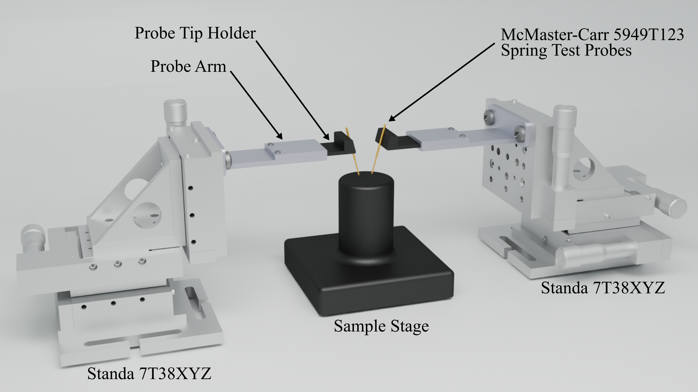
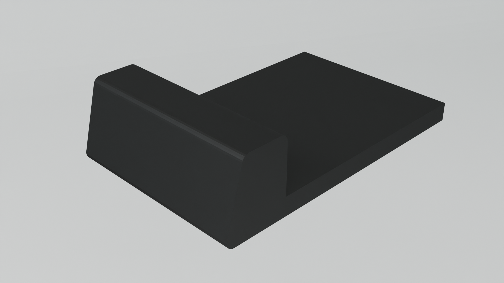
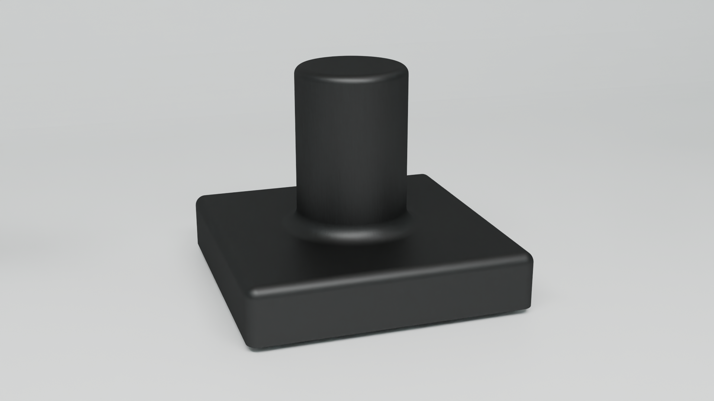
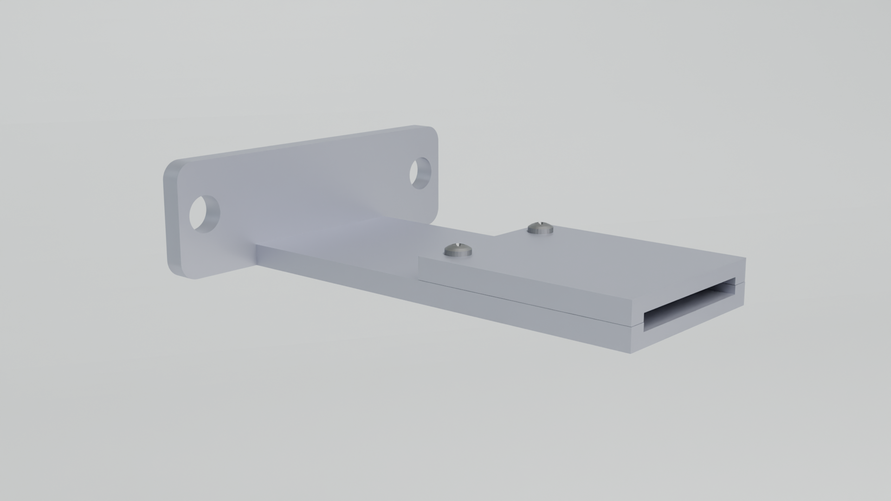

# 3D-Printed Probe Station for Two-Contact Measurements



| Probe Tip Holder | Sample Stage | Probe Arm |
| :---: | :---: | :---: |
| |  |   |


## 🔖 Overview

This repository contains the 3D design files and technical specifications for a **Probe Station** designed for simple two-contact electrical measurements. Developed at the **Universidad Complutense de Madrid** at 2025, this design provides a cost-effective solution for researchers needing precise probe positioning without the high cost of industrial stations.

The design has a hybrid approach, combining custom 3D-printed components with commercial products.

### System Architecture

The station is composed of three primary functional groups:

* **3D Printed Components:** Custom-designed **Probe Tip Holders** and a centralized **Sample Stage** designed for easy fabrication and replacement.
* **Supporting Structures:** A **Probe Arm** that bridges the 3D-printed holders to the mechanical stages.
* **Precision Positioning:** Utilizes **Standa 7T38XYZ** stages for micrometer-level control over the probe contact.

---

## 💾 Technical Specifications

### 1. 3D Printed Parts (Custom)

These parts are designed for FDM or SLA 3D printing.

* **Probe Tip Holder:** A specialized mount designed to securely friction-fit or glue spring-loaded pogo pins.
* **Sample Stage:** A stable, elevated platform for mounting thin films, wafers, or devices under test (DUT).
* **Probe Arm:** A rigid extension piece that ensures the probe tip reaches the center of the sample stage while maintaining clearance for the XYZ stage movement.

### 2. Commercial Components & Alternatives

The design is compatible with the following hardware, or their budget-friendly equivalents:

| Component | Primary Recommendation | Alternative Options |
| --- | --- | --- |
| **XYZ Stage** | [Standa 7T38XYZ](https://www.standa.lt/products/catalog/translation_rotation?item=43) | Newport stages, AliExpress XYZ manual stages |
| **Probe Tips** | [McMaster-Carr 5949T123](https://www.mcmaster.com/products/pogo-pins/) | Nickel or Gold-plated Pogo Pins (AliExpress/eBay) |

---

## 🛠️ Software Stack

The development of this project utilized an open-source and professional creative workflow:

* **FreeCAD:** Used for the parametric 3D modeling of all custom mechanical parts.
* **Blender:** Used for high-fidelity photorealistic rendering and visualization of the assembly.
* **Inkscape:** Used for generating technical 2D drafts, annotations, and final labeling.

---

## 💼 Repository Structure

```text
├── models/             # 3D Source files and CAD (FreeCAD)
│   ├── ProbeTipHolder.FCStd 
│   ├── SampleStage.FCStd
│   └── ProbeArm.FCStd
├── stl/                # Print-ready files
│   ├── ProbeTipHolder.stl
│   └── SampleStage.stl
├── images/             # Renders and project photos
│   └── image_probeStation.png
│   └── image_ProbeHolder.png
│   └── image_SampleStage.png
│   └── image_ProbeArm.png
└── README.md

```

## 📜 License

This project is licensed under the **MIT License**. You are free to use, modify, and distribute these designs for both academic and commercial purposes.
